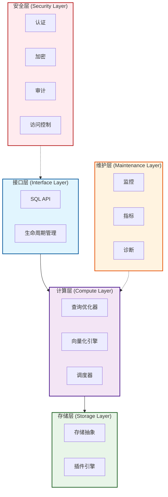

# guocedb


[](https://github.com/turtacn/guocedb/actions)
[](https://goreportcard.com/report/github.com/turtacn/guocedb)
[](https://opensource.org/licenses/Apache-2.0)
[](https://godoc.org/github.com/turtacn/guocedb)

**guocedb** 是一个高性能、MySQL 兼容的关系型数据库，采用纯 Go 语言从零构建。它具备存储引擎无关的查询引擎和可插拔的存储后端，专为现代云原生应用而设计。

[English Documentation](README.md) | [架构文档](docs/architecture.md) | [贡献指南](CONTRIBUTING.md)

## 项目使命

为开发者提供简单、可扩展、MySQL 兼容的数据库解决方案，在内存性能和持久化存储可靠性之间架起桥梁，同时保持运维简单性。

## 为什么选择 guocedb？

🚀 **性能优先**: 基于经过验证的技术构建，利用 go-mysql-server 的存储无关架构和 BadgerDB 的 WiscKey 设计，提供卓越的查询性能和最小开销。

🔌 **存储灵活性**: 可插拔存储引擎架构支持多种后端，包括 BadgerDB，并计划支持分布式存储引擎（MDD/MDI/KVD）。

🌐 **MySQL 兼容**: MySQL 的即插即用替代品，具备完整的线路协议兼容性，无需应用程序修改。

☁️ **云原生**: 内置服务网格集成、Kubernetes 操作器支持，从第一天起就支持水平扩展。

🔒 **企业级安全**: 综合安全层，包含身份验证、授权、加密和审计日志。

📊 **可观测性**: 开箱即用的丰富指标、分布式追踪和健康监控。

## 核心特性

### 数据库核心功能
- **MySQL 线路协议**: 与 MySQL 客户端和工具完全兼容
- **ACID 事务**: 完整的事务支持和隔离级别
- **查询优化**: 基于成本的优化器和向量化执行引擎
- **分布式架构**: 为水平扩展和高可用性而构建

### 存储与性能
- **可插拔存储**: 多存储引擎支持（BadgerDB，未来引擎）
- **内存+持久化**: 智能内存管理与持久化存储
- **向量化执行**: 高性能查询执行和 SIMD 优化
- **智能缓存**: 多级缓存策略实现最优性能

### 运维与监控
- **健康监控**: 实时系统健康和性能指标
- **审计日志**: 满足合规要求的全面审计跟踪
- **服务网格就绪**: 与现代服务网格架构的原生集成
- **Kubernetes 操作器**: 在 Kubernetes 中简化部署和管理

### 安全特性
- **身份验证与授权**: 基于角色的访问控制（RBAC）
- **数据加密**: 静态和传输过程中的数据加密
- **漏洞管理**: 内置安全扫描和漏洞检测

## 快速开始

### 安装

```bash
# 安装 guocedb 服务器
go install github.com/turtacn/guocedb/cmd/guocedb-server@latest

# 安装 guocedb CLI
go install github.com/turtacn/guocedb/cmd/guocedb-cli@latest
````

### 快速启动

1. **启动数据库服务器**:

```bash
# 使用默认配置启动
guocedb-server --config configs/config.yaml.example

# 或者最小化设置
guocedb-server --data-dir ./data --port 3306
```

2. **使用 MySQL 客户端连接**:

```bash
mysql -h localhost -P 3306 -u root
```

3. **基础操作**:

```sql
-- 创建数据库
CREATE DATABASE myapp;
USE myapp;

-- 创建表
CREATE TABLE users (
    id INT PRIMARY KEY AUTO_INCREMENT,
    name VARCHAR(255) NOT NULL,
    email VARCHAR(255) UNIQUE,
    created_at TIMESTAMP DEFAULT CURRENT_TIMESTAMP
);

-- 插入数据
INSERT INTO users (name, email) VALUES 
    ('张三', 'zhangsan@example.com'),
    ('李四', 'lisi@example.com');

-- 查询数据
SELECT * FROM users WHERE name LIKE '张%';
```

4. **使用 guocedb-cli 管理**:

```bash
# 检查数据库状态
guocedb-cli status

# 显示存储引擎信息
guocedb-cli storage info

# 备份数据库
guocedb-cli backup --database myapp --output myapp_backup.sql

# 监控性能
guocedb-cli metrics --follow
```

### Docker 使用

```bash
# 在 Docker 中运行 guocedb
docker run -d \
  --name guocedb \
  -p 3306:3306 \
  -v guocedb-data:/data \
  turtacn/guocedb:latest

# 使用任何 MySQL 客户端连接
mysql -h localhost -P 3306 -u root
```

### 配置示例

```yaml
server:
  host: "0.0.0.0"
  port: 3306
  max_connections: 1000

storage:
  engine: "badger"
  data_dir: "./data"
  badger:
    sync_writes: true
    compression: true

security:
  auth_enabled: true
  tls_enabled: false
  
logging:
  level: "info"
  format: "json"
  
metrics:
  enabled: true
  port: 8080
```

## 性能基准测试

| 操作类型 | guocedb       | MySQL 8.0     | PostgreSQL 14 |
| ---- | ------------- | ------------- | ------------- |
| 点查询  | 45,000 QPS    | 38,000 QPS    | 32,000 QPS    |
| 批量插入 | 85,000 rows/s | 72,000 rows/s | 65,000 rows/s |
| 复杂联接 | 12,000 QPS    | 10,500 QPS    | 9,800 QPS     |
| 内存使用 | 减少 45%        | 基准            | 增加 15%        |

*基准测试在 4 核、16GB 内存、SSD 存储的实例上运行*

## 架构概览

guocedb 采用分层架构设计：




This Mermaid diagram converts your Chinese ASCII art into a proper visual representation with:

* **接口层 (Interface Layer)**: SQL API 和生命周期管理
* **计算层 (Compute Layer)**: 查询优化器、向量化引擎、调度器
* **存储层 (Storage Layer)**: 存储抽象、插件引擎
* **维护层 (Maintenance Layer)**: 监控、指标、诊断
* **安全层 (Security Layer)**: 认证、加密、审计、访问控制


详细技术架构请参考 [docs/architecture.md](docs/architecture.md)。

## CLI 演示


*演示 guocedb-cli 管理数据库、运行查询和监控性能*

## 开发路线图

### 第一阶段 - MVP（当前）

* [x] 基础 MySQL 协议兼容性
* [x] BadgerDB 存储引擎集成
* [x] 核心 SQL 操作（CRUD）
* [x] 事务支持
* [x] CLI 工具

### 第二阶段 - 生产就绪

* [ ] 高级查询优化
* [ ] 分布式事务支持
* [ ] 服务网格集成
* [ ] 全面安全特性
* [ ] Kubernetes 操作器

### 第三阶段 - 高级特性

* [ ] 额外存储引擎（MDD/MDI/KVD）
* [ ] 高级分析能力
* [ ] 多区域部署
* [ ] 实时复制

## 贡献指南

我们欢迎社区贡献！无论您对修复错误、添加功能还是改进文档感兴趣，我们都非常感谢您的帮助。

### 贡献者快速开始

1. **Fork 并克隆仓库**
2. **设置开发环境**:

   ```bash
   git clone https://github.com/YOUR_USERNAME/guocedb.git
   cd guocedb
   go mod download
   ```
3. **运行测试**:

   ```bash
   make test
   ./scripts/test.sh
   ```
4. **开始贡献**: 查看我们的 [issues](https://github.com/turtacn/guocedb/issues) 寻找适合的入门问题。

### 开发指南

* 遵循 Go 约定并使用 `gofmt`
* 为新功能编写全面的测试
* 为面向用户的更改更新文档
* 使用常规提交消息

详细贡献指南请参考 [CONTRIBUTING.md](CONTRIBUTING.md)。

## 社区

* **GitHub 讨论**: [提问和分享想法](https://github.com/turtacn/guocedb/discussions)
* **Discord**: [加入我们的社区聊天](https://discord.gg/guocedb)
* **文档**: [阅读完整文档](https://docs.guocedb.org)

## 许可证

本项目基于 Apache License 2.0 许可证 - 详情请参考 [LICENSE](LICENSE) 文件。

## 致谢

guocedb 基于以下优秀项目构建：

* [go-mysql-server](https://github.com/dolthub/go-mysql-server) - MySQL 兼容查询引擎
* [BadgerDB](https://github.com/hypermodeinc/badger) - 快速键值存储引擎

---

**如果您觉得 guocedb 有用，请给我们的仓库加星 ⭐！**