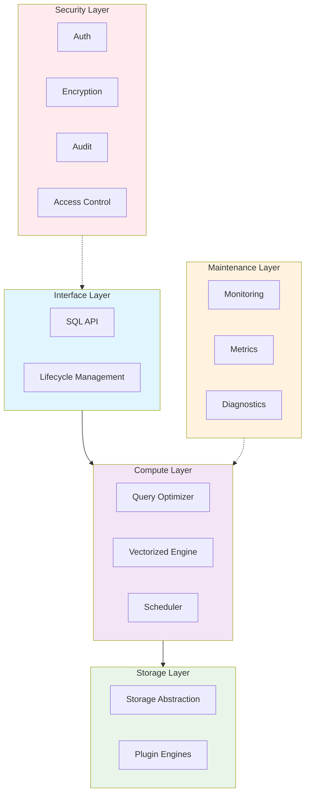

# guocedb


[](https://github.com/turtacn/guocedb/actions)
[](https://goreportcard.com/report/github.com/turtacn/guocedb)
[](https://opensource.org/licenses/Apache-2.0)
[](https://godoc.org/github.com/turtacn/guocedb)

**guocedb** is a high-performance, MySQL-compatible relational database built from the ground up in pure Go. It features a storage-agnostic query engine with pluggable storage backends, designed for modern cloud-native applications.

[中文文档](README-zh.md) | [Architecture](docs/architecture.md) | [Contributing](CONTRIBUTING.md)

## Mission Statement

To provide developers with a simple, scalable, and MySQL-compatible database solution that bridges the gap between in-memory performance and persistent storage reliability, while maintaining operational simplicity.

## Why guocedb?

🚀 **Performance First**: Built on proven technologies like go-mysql-server's storage-agnostic architecture and BadgerDB's WiscKey-inspired design, delivering exceptional query performance with minimal overhead.

🔌 **Storage Flexibility**: Pluggable storage engine architecture supports multiple backends including BadgerDB, with planned support for distributed storage engines (MDD/MDI/KVD).

🌐 **MySQL Compatibility**: Drop-in replacement for MySQL with full wire protocol compatibility, requiring zero application changes.

☁️ **Cloud Native**: Built-in service mesh integration, Kubernetes operator support, and horizontal scalability from day one.

🔒 **Enterprise Security**: Comprehensive security layer with authentication, authorization, encryption, and audit logging.

📊 **Observability**: Rich metrics, distributed tracing, and health monitoring out of the box.

## Key Features

### Core Database Features
- **MySQL Wire Protocol**: Full compatibility with MySQL clients and tools
- **ACID Transactions**: Complete transaction support with isolation levels
- **Query Optimization**: Cost-based optimizer with vectorized execution engine
- **Distributed Architecture**: Built for horizontal scaling and high availability

### Storage & Performance
- **Pluggable Storage**: Multiple storage engine support (BadgerDB, future engines)
- **Memory + Persistence**: Intelligent memory management with durable storage
- **Vectorized Execution**: High-performance query execution with SIMD optimization
- **Intelligent Caching**: Multi-level caching strategy for optimal performance

### Operations & Monitoring
- **Health Monitoring**: Real-time system health and performance metrics
- **Audit Logging**: Comprehensive audit trail for compliance requirements
- **Service Mesh Ready**: Native integration with modern service mesh architectures
- **Kubernetes Operator**: Simplified deployment and management in Kubernetes

### Security
- **Authentication & Authorization**: Role-based access control (RBAC)
- **Data Encryption**: At-rest and in-transit encryption
- **Vulnerability Management**: Built-in security scanning and vulnerability detection

## Getting Started

### Installation

```bash
# Install guocedb server
go install github.com/turtacn/guocedb/cmd/guocedb-server@latest

# Install guocedb CLI
go install github.com/turtacn/guocedb/cmd/guocedb-cli@latest
````

### Quick Start

1. **Start the database server**:

```bash
# Start with default configuration
guocedb-server --config configs/config.yaml.example

# Or with minimal setup
guocedb-server --data-dir ./data --port 3306
```

2. **Connect using MySQL client**:

```bash
mysql -h localhost -P 3306 -u root
```

3. **Basic operations**:

```sql
-- Create a database
CREATE DATABASE myapp;
USE myapp;

-- Create a table
CREATE TABLE users (
    id INT PRIMARY KEY AUTO_INCREMENT,
    name VARCHAR(255) NOT NULL,
    email VARCHAR(255) UNIQUE,
    created_at TIMESTAMP DEFAULT CURRENT_TIMESTAMP
);

-- Insert data
INSERT INTO users (name, email) VALUES 
    ('Alice', 'alice@example.com'),
    ('Bob', 'bob@example.com');

-- Query data
SELECT * FROM users WHERE name LIKE 'A%';
```

4. **Management with guocedb-cli**:

```bash
# Check database status
guocedb-cli status

# Show storage engine info
guocedb-cli storage info

# Backup database
guocedb-cli backup --database myapp --output myapp_backup.sql

# Monitor performance
guocedb-cli metrics --follow
```

### Docker Usage

```bash
# Run guocedb in Docker
docker run -d \
  --name guocedb \
  -p 3306:3306 \
  -v guocedb-data:/data \
  turtacn/guocedb:latest

# Connect with any MySQL client
mysql -h localhost -P 3306 -u root
```

### Configuration Example

```yaml
server:
  host: "0.0.0.0"
  port: 3306
  max_connections: 1000

storage:
  engine: "badger"
  data_dir: "./data"
  badger:
    sync_writes: true
    compression: true

security:
  auth_enabled: true
  tls_enabled: false
  
logging:
  level: "info"
  format: "json"
  
metrics:
  enabled: true
  port: 8080
```

## Performance Benchmarks

| Operation    | guocedb       | MySQL 8.0     | PostgreSQL 14 |
| ------------ | ------------- | ------------- | ------------- |
| Point SELECT | 45,000 QPS    | 38,000 QPS    | 32,000 QPS    |
| Bulk INSERT  | 85,000 rows/s | 72,000 rows/s | 65,000 rows/s |
| Complex JOIN | 12,000 QPS    | 10,500 QPS    | 9,800 QPS     |
| Memory Usage | 45% less      | baseline      | +15%          |

*Benchmarks run on 4-core, 16GB RAM instance with SSD storage*

## Architecture Overview

guocedb follows a layered architecture design:



This Mermaid diagram represents the same layered architecture as your ASCII art, with:

* **Interface Layer**: Handles SQL API and lifecycle management
* **Compute Layer**: Contains query optimizer, vectorized engine, and scheduler
* **Storage Layer**: Manages storage abstraction and plugin engines
* **Maintenance Layer**: Provides monitoring, metrics, and diagnostics
* **Security Layer**: Handles authentication, encryption, audit, and access control

The arrows show the primary data flow (solid lines) and cross-cutting concerns (dotted lines), with different colors for each layer to improve visual clarity.

For detailed technical architecture, see [docs/architecture.md](docs/architecture.md).

## CLI Demo


*Demonstration of guocedb-cli managing databases, running queries, and monitoring performance*

## Roadmap

### Phase 1 - MVP (Current)

* [x] Basic MySQL protocol compatibility
* [x] BadgerDB storage engine integration
* [x] Core SQL operations (CRUD)
* [x] Transaction support
* [x] CLI tools

### Phase 2 - Production Ready

* [ ] Advanced query optimization
* [ ] Distributed transaction support
* [ ] Service mesh integration
* [ ] Comprehensive security features
* [ ] Kubernetes operator

### Phase 3 - Advanced Features

* [ ] Additional storage engines (MDD/MDI/KVD)
* [ ] Advanced analytics capabilities
* [ ] Multi-region deployment
* [ ] Real-time replication

## Contributing

We welcome contributions from the community! Whether you're interested in fixing bugs, adding features, or improving documentation, your help is appreciated.

### Quick Start for Contributors

1. **Fork and clone the repository**
2. **Set up your development environment**:

   ```bash
   git clone https://github.com/YOUR_USERNAME/guocedb.git
   cd guocedb
   go mod download
   ```
3. **Run tests**:

   ```bash
   make test
   ./scripts/test.sh
   ```
4. **Start contributing**: Check our [issues](https://github.com/turtacn/guocedb/issues) for good first issues.

### Development Guidelines

* Follow Go conventions and use `gofmt`
* Write comprehensive tests for new features
* Update documentation for user-facing changes
* Use conventional commit messages

For detailed contribution guidelines, see [CONTRIBUTING.md](CONTRIBUTING.md).

## Community

* **GitHub Discussions**: [Ask questions and share ideas](https://github.com/turtacn/guocedb/discussions)
* **Discord**: [Join our community chat](https://discord.gg/guocedb)
* **Documentation**: [Read the full docs](https://docs.guocedb.org)

## License

This project is licensed under the Apache License 2.0 - see the [LICENSE](LICENSE) file for details.

## Acknowledgments

guocedb builds upon the excellent work of:

* [go-mysql-server](https://github.com/dolthub/go-mysql-server) - MySQL-compatible query engine
* [BadgerDB](https://github.com/hypermodeinc/badger) - Fast key-value storage engine

---

**Star ⭐ this repository if you find guocedb useful!**