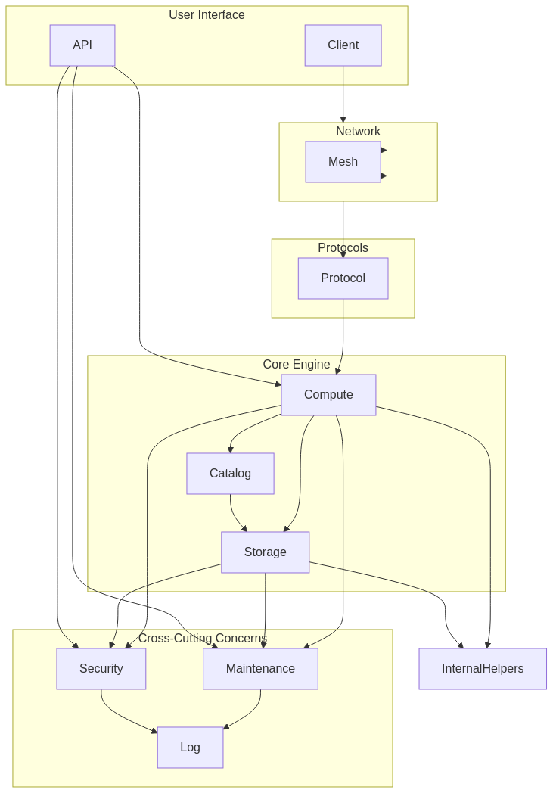

# Guocedb

Guocedb is a distributed SQL database built with Go, leveraging the go-mysql-server framework and initially using BadgerDB as a storage engine. It is designed with a layered architecture to be modular, scalable, and extensible.

**Note:** This project is currently under development and is not ready for production use. It serves as a learning exercise and a foundation for building a robust distributed database.

**Note:** Detailed architecture & design could be found at 


## Features

* **SQL Compatibility:** Supports a significant subset of MySQL syntax via the go-mysql-server framework.
* **MySQL Protocol:** Communicates using the standard MySQL wire protocol, allowing compatibility with existing MySQL clients.
* **Pluggable Storage Engine:** Designed to support various storage engines (currently implementing a BadgerDB integration).
* **Layered Architecture:** Clearly defined layers for common concerns like networking, protocol handling, compute (SQL processing), storage, security, and maintenance.
* **Command-Line Interface (CLI):** A basic CLI tool for interacting with the database.
* **Configuration:** Configurable via a YAML file.
* **Basic Logging:** Integrated logging system.

**Planned / Future Features:**

* Distributed Clustering and Replication (via the Network Mesh layer)
* Support for other Storage Engines (e.g., Key-Value Data, Multi-Dimensional Data, Multi-Dimensional Index placeholders)
* Advanced Security Features (Authentication, Authorization, Encryption, Auditing)
* Management API (gRPC/Protobuf) and REST API
* Maintenance Tools (Metrics, Status, Diagnostics)
* Query Optimization and Vectorized Execution
* Comprehensive Testing (Unit and Integration)

## Architecture

Guocedb follows a layered architecture:



  * **Network:** Handles incoming network connections and routes them to the appropriate protocol handler. Includes a placeholder for inter-node mesh networking in a distributed setup.
  * **Protocol:** Implements specific database wire protocols (currently MySQL). Deserializes client requests and serializes responses.
  * **Compute:** The core SQL processing layer. Includes the Parser, Analyzer, Optimizer, Executor, Plan representation, Catalog (metadata), and Transaction Management. Heavily relies on the go-mysql-server framework.
  * **Storage:** Manages data persistence. Provides an interface for interacting with various storage engine implementations (like BadgerDB). Handles transactions at the storage level.
  * **Security:** Implements authentication, authorization, encryption, and auditing.
  * **Maintenance:** Provides tools for operational tasks like collecting metrics, reporting status, and diagnostics.
  * **Internal:** Contains internal helper utilities (e.g., encoding/decoding, common utils).
  * **Common:** Shared foundational components like configuration, error handling, logging, and common types.

## Getting Started

### Prerequisites

  * Go (version 1.18 or later recommended)
  * Git

### Cloning the Repository

```bash
git clone https://github.com/turtacn/guocedb.git
cd guocedb
```

### Building Guocedb

Use the provided build script to compile the server and client binaries.

```bash
chmod +x scripts/build.sh
./scripts/build.sh
```

This will create `guocedb_server` and `guocedb_cli` executables in the `./bin` directory.

### Running the Server

Use the example configuration file to start the server.

```bash
# Make sure you have a config.yaml (copy from config.yaml.example)
cp configs/config.yaml.example config.yaml

# Create data directories if needed (configured in config.yaml)
mkdir -p ./data/badger

# Run the server
./bin/guocedb_server --config config.yaml
```

The server will start listening on the configured network addresses (default MySQL port: 3306, default REST API port: 8080 if enabled). Press `Ctrl+C` to stop the server gracefully.

### Connecting to Guocedb

You can connect to the running Guocedb server using the provided CLI tool or any standard MySQL client.

**Using guocedb_cli:**

```bash
# Connect and execute a query
./bin/guocedb_cli -h 127.0.0.1 -P 3306 -u root -p password -e "SELECT 'Hello, Guocedb!';"

# Connect and specify a database (if created)
# ./bin/guocedb_cli -h 127.0.0.1 -P 3306 -u root -p password -D mydatabase -e "SELECT * FROM mytable;"
```

**Using a standard MySQL client (e.g., `mysql` command-line tool):**

```bash
mysql -h 127.0.0.1 -P 3306 -u root -p password
```

You can then execute SQL commands within the MySQL client session.

## Configuration

Guocedb is configured using a YAML file. An example is provided at `configs/config.yaml.example`.

Copy this file to `config.yaml` and edit it to suit your needs. The command-line server executable uses the `--config` flag to specify the configuration file path.

Key configuration sections include:

  * `logging`: Configures log level, format, and output.
  * `storage`: Configures the storage engine type and its specific settings (e.g., Badger data paths).
  * `network`: Configures the network listeners for different protocols (MySQL, REST API).
  * `security` (Placeholder): Configuration for authentication and authorization.
  * `maintenance` (Placeholder): Configuration for metrics and status endpoints.
  * `clustering` (Placeholder): Configuration for distributed setup.

## Testing

Run the test script to execute the project's unit and integration tests.

```bash
chmod +x scripts/test.sh
./scripts/test.sh
```

  * **Unit Tests:** Located in `test/unit`. Test individual components in isolation.
  * **Integration Tests:** Located in `test/integration`. Test the interaction between components and require a running server instance (managed by `TestMain`).

## Future Work

This project is a starting point. Significant areas for future development include:

  * Full implementation of placeholder storage engines (KVD, MDD, MDI).
  * Implementing the distributed mesh network for clustering and replication.
  * Adding robust security features (encryption, full authentication methods, fine-grained authorization).
  * Developing the Management API (gRPC) and REST API.
  * Implementing comprehensive maintenance and diagnostic tools.
  * Advanced query optimization techniques and vectorized execution.
  * Improving error handling and reliability.
  * Adding documentation and examples.

## Contributing

Contributions are welcome\! Please feel free to open issues or submit pull requests.

## License

This project is licensed under the Apache License, Version 2.0. See the [https://www.google.com/search?q=LICENSE](https://www.google.com/search?q=LICENSE) file for details.


