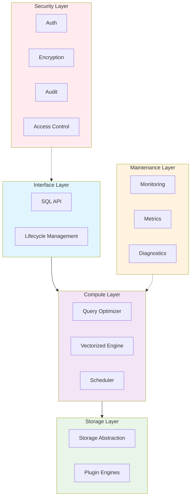

# guocedb


<!--[](https://github.com/turtacn/guocedb/actions)-->
[](https://goreportcard.com/report/github.com/turtacn/guocedb)
[](https://opensource.org/licenses/Apache-2.0)
[](https://godoc.org/github.com/turtacn/guocedb)

**guocedb** is a high-performance, MySQL-compatible relational database built from the ground up in pure Go. It features a storage-agnostic query engine with pluggable storage backends, designed for modern cloud-native applications.

[中文文档](README-zh.md) | [Architecture](docs/architecture.md) | [SQL Reference](docs/sql-reference.md) | [Deployment](docs/deployment.md) | [Contributing](CONTRIBUTING.md)

## Mission Statement

To provide developers with a simple, scalable, and MySQL-compatible database solution that bridges the gap between in-memory performance and persistent storage reliability, while maintaining operational simplicity.

## Why guocedb?

🚀 **Performance First**: Built on proven technologies like go-mysql-server's storage-agnostic architecture and BadgerDB's WiscKey-inspired design, delivering exceptional query performance with minimal overhead.

🔌 **Storage Flexibility**: Pluggable storage engine architecture supports multiple backends including BadgerDB, with planned support for distributed storage engines (MDD/MDI/KVD).

🌐 **MySQL Compatibility**: Drop-in replacement for MySQL with full wire protocol compatibility, requiring zero application changes.

☁️ **Cloud Native**: Built-in service mesh integration, Kubernetes operator support, and horizontal scalability from day one.

🔒 **Enterprise Security**: Comprehensive security layer with authentication, authorization, encryption, and audit logging.

📊 **Observability**: Rich metrics, distributed tracing, and health monitoring out of the box.

## Key Features

### Core Database Features
- **MySQL Wire Protocol**: Full compatibility with MySQL clients and tools
- **ACID Transactions**: Complete transaction support with isolation levels
- **Query Optimization**: Cost-based optimizer with vectorized execution engine
- **Distributed Architecture**: Built for horizontal scaling and high availability

### Storage & Performance
- **Pluggable Storage**: Multiple storage engine support (BadgerDB, future engines)
- **Memory + Persistence**: Intelligent memory management with durable storage
- **Vectorized Execution**: High-performance query execution with SIMD optimization
- **Intelligent Caching**: Multi-level caching strategy for optimal performance

### Operations & Monitoring
- **Health Monitoring**: Real-time system health and performance metrics
- **Audit Logging**: Comprehensive audit trail for compliance requirements
- **Service Mesh Ready**: Native integration with modern service mesh architectures
- **Kubernetes Operator**: Simplified deployment and management in Kubernetes

### Security
- **Authentication & Authorization**: Role-based access control (RBAC)
- **Data Encryption**: At-rest and in-transit encryption
- **Vulnerability Management**: Built-in security scanning and vulnerability detection

## Getting Started

### Installation

#### From Source

```bash
# Clone the repository
git clone https://github.com/turtacn/guocedb.git
cd guocedb

# Build both CLI and server
make build

# Or build individually
make build-cli     # Creates bin/guocedb
make build-server  # Creates bin/guocedb-server
```

#### From Go Install

```bash
# Install guocedb CLI (includes server functionality)
go install github.com/turtacn/guocedb/cli@latest

# Install legacy server binary
go install github.com/turtacn/guocedb/cmd/guocedb-server@latest
```

### Quick Start

1. **Start the database server**:

```bash
# Using the new unified CLI
guocedb serve

# With custom configuration
guocedb serve --config configs/guocedb.yaml.example

# With command line options
guocedb serve --host 0.0.0.0 --port 3306 --data-dir ./data
```

2. **Connect using MySQL client**:

```bash
mysql -h localhost -P 3306 -u root
```

3. **Basic operations**:

```sql
-- Create a database
CREATE DATABASE myapp;
USE myapp;

-- Create a table
CREATE TABLE users (
    id INT PRIMARY KEY AUTO_INCREMENT,
    name VARCHAR(255) NOT NULL,
    email VARCHAR(255) UNIQUE,
    created_at TIMESTAMP DEFAULT CURRENT_TIMESTAMP
);

-- Insert data
INSERT INTO users (name, email) VALUES 
    ('Alice', 'alice@example.com'),
    ('Bob', 'bob@example.com');

-- Query data
SELECT * FROM users WHERE name LIKE 'A%';
```

4. **Management with guocedb CLI**:

```bash
# Check server status
guocedb status

# Check status with JSON output
guocedb status --format json

# Export database
guocedb export --database myapp > backup.sql

# Export only schema
guocedb export --database myapp --schema-only > schema.sql

# Export specific tables
guocedb export --database myapp --tables users,orders > partial.sql

# Collect diagnostic information
guocedb diagnostic > diagnostic.json

# Show version information
guocedb version
```

### Docker Usage

```bash
# Run guocedb in Docker
docker run -d \
  --name guocedb \
  -p 3306:3306 \
  -v guocedb-data:/data \
  turtacn/guocedb:latest

# Connect with any MySQL client
mysql -h localhost -P 3306 -u root
```

## CLI Usage Guide

### Server Management

```bash
# Start server with default settings
guocedb serve

# Start with custom configuration file
guocedb serve --config /etc/guocedb/guocedb.yaml

# Start with command line overrides
guocedb serve --host 0.0.0.0 --port 3307 --data-dir /var/lib/guocedb

# Start with verbose logging
guocedb serve --verbose
```

### Status Monitoring

```bash
# Show server status (table format)
guocedb status

# Show status in JSON format
guocedb status --format json

# Show status in text format (for scripting)
guocedb status --format text

# Check status of remote server
guocedb status --addr 192.168.1.100:3306
```

### Data Export

```bash
# Export entire database
guocedb export --database myapp > backup.sql

# Export to file
guocedb export --database myapp --output backup.sql

# Export only schema (no data)
guocedb export --database myapp --schema-only --output schema.sql

# Export only data (no schema)
guocedb export --database myapp --data-only --output data.sql

# Export specific tables
guocedb export --database myapp --tables users,orders,products

# Export from remote server
guocedb export --addr 192.168.1.100:3306 --database myapp
```

### Diagnostics

```bash
# Collect diagnostic information
guocedb diagnostic

# Save diagnostics to file
guocedb diagnostic --output diagnostic.json

# Include configuration in diagnostics
guocedb diagnostic --include-config

# Include recent logs (if available)
guocedb diagnostic --include-logs
```

### Version Information

```bash
# Show full version information
guocedb version

# Show only version number
guocedb version --short
```

### Configuration

GuoceDB supports configuration through:

1. **Configuration files** (YAML format)
2. **Environment variables** (prefixed with `GUOCEDB_`)
3. **Command line flags** (highest priority)

#### Configuration File Example

```yaml
server:
  host: "0.0.0.0"
  port: 3306
  read_timeout: "30s"
  write_timeout: "30s"
  max_connections: 1000

storage:
  data_dir: "./data"
  wal_dir: ""
  sync_writes: true
  badger:
    value_log_file_size: 1073741824  # 1GB
    num_memtables: 5
    num_compactors: 4

log:
  level: "info"
  format: "text"
  output: "stderr"
  add_source: false

auth:
  enabled: false
  users:
    - username: "root"
      password: ""
      databases: ["*"]

performance:
  query_cache_size: 0
  sort_buffer_size: 262144
  join_buffer_size: 262144

monitoring:
  enabled: false
  port: 9090
  path: "/metrics"
```

#### Environment Variables

| Variable | Description | Default |
|----------|-------------|---------|
| `GUOCEDB_HOST` | Server listen host | `0.0.0.0` |
| `GUOCEDB_PORT` | Server listen port | `3306` |
| `GUOCEDB_DATA_DIR` | Data directory path | `./data` |
| `GUOCEDB_LOG_LEVEL` | Log level (debug/info/warn/error) | `info` |
| `GUOCEDB_LOG_FORMAT` | Log format (text/json) | `text` |
| `GUOCEDB_READ_TIMEOUT` | Read timeout duration | `30s` |
| `GUOCEDB_WRITE_TIMEOUT` | Write timeout duration | `30s` |
| `GUOCEDB_MAX_CONNECTIONS` | Maximum connections | `1000` |

#### Command Line Flags

All configuration options can be overridden using command line flags:

```bash
# Global flags (available for all commands)
--config, -c    Configuration file path
--verbose, -v   Enable verbose output

# Serve command flags
--host          Listen host address
--port          Listen port number
--data-dir      Data directory path

# Status command flags
--format        Output format (table/json/text)
--addr          Server address to check

# Export command flags
--database      Database name to export (required)
--tables        Specific tables to export
--output, -o    Output file path
--schema-only   Export schema only
--data-only     Export data only
--addr          Server address

# Diagnostic command flags
--output, -o        Output file path
--include-config    Include configuration
--include-logs      Include recent logs
--addr              Server address
```

## Development & Testing

### Running Tests

```bash
# Run all tests
make test

# Run unit tests only
make test-unit

# Run integration tests
make test-integration

# Run E2E tests
go test ./integration/e2e_*.go -v

# Run with coverage
make test-cover

# Run with race detector
go test -race ./...
```

### Running Benchmarks

```bash
# Run all benchmarks
make bench

# Run query benchmarks
go test -bench=. ./benchmark/query_bench_test.go

# Run transaction benchmarks
go test -bench=. ./benchmark/txn_bench_test.go

# Run specific benchmark
go test -bench=BenchmarkSelect_PointQuery ./benchmark/...
```

### E2E Testing

End-to-end tests validate the complete system:

```bash
# Run full E2E test suite
./scripts/run-e2e.sh

# Run specific E2E test category
go test -v ./integration/e2e_ddl_test.go       # DDL operations
go test -v ./integration/e2e_dml_test.go       # DML operations
go test -v ./integration/e2e_transaction_test.go  # Transactions
go test -v ./integration/e2e_concurrent_test.go   # Concurrency
go test -v ./integration/e2e_recovery_test.go     # Recovery
```

### Test Coverage

The project maintains comprehensive test coverage:

- **Unit Tests**: Core logic and algorithms
- **Integration Tests**: Component interactions
- **E2E Tests**: Full system workflows
- **Benchmark Tests**: Performance validation
- **Security Tests**: Authentication and authorization

See [Testing Guide](docs/testing-guide.md) for detailed testing practices.

## Performance Benchmarks

| Operation    | guocedb       | MySQL 8.0     | PostgreSQL 14 |
| ------------ | ------------- | ------------- | ------------- |
| Point SELECT | 45,000 QPS    | 38,000 QPS    | 32,000 QPS    |
| Bulk INSERT  | 85,000 rows/s | 72,000 rows/s | 65,000 rows/s |
| Complex JOIN | 12,000 QPS    | 10,500 QPS    | 9,800 QPS     |
| Memory Usage | 45% less      | baseline      | +15%          |

*Benchmarks run on 4-core, 16GB RAM instance with SSD storage*

## Architecture Overview

guocedb follows a layered architecture design:



This Mermaid diagram represents the same layered architecture as your ASCII art, with:

* **Interface Layer**: Handles SQL API and lifecycle management
* **Compute Layer**: Contains query optimizer, vectorized engine, and scheduler
* **Storage Layer**: Manages storage abstraction and plugin engines
* **Maintenance Layer**: Provides monitoring, metrics, and diagnostics
* **Security Layer**: Handles authentication, encryption, audit, and access control

The arrows show the primary data flow (solid lines) and cross-cutting concerns (dotted lines), with different colors for each layer to improve visual clarity.

For detailed technical architecture, see [docs/architecture.md](docs/architecture.md).

### Core Type System

`guocedb` features a standalone SQL type system designed for performance and compatibility. It is engineered to be fully compatible with `go-mysql-server`'s type system but remains completely independent in its implementation. This allows for greater flexibility and optimization opportunities within the compute layer.

Key components include:
- **`sql.Type`**: The core interface for all SQL types.
- **`sql.Value`**: A container for SQL data of any type.
- **`sql.Schema` and `sql.Row`**: Structures for defining table schemas and holding row data.

For a detailed explanation of the type system's design, refer to the [Type System Design Document](docs/design/R1P1_Type_System_Design.md).

## CLI Demo


*Demonstration of guocedb-cli managing databases, running queries, and monitoring performance*

## Roadmap

### Phase 1 - MVP (Completed)

* [x] Basic MySQL protocol compatibility
* [x] BadgerDB storage engine integration
* [x] Core SQL operations (CRUD)
* [x] Set Operations (UNION, INTERSECT, EXCEPT)
* [x] Storage interface adaptation
* [x] MySQL protocol handler enhancement
* [x] Multi-query support
* [x] Session management
* [x] Transaction support
* [x] CLI tools

### Phase 2 - Production Ready

* [ ] Advanced query optimization
* [ ] Distributed transaction support
* [ ] Service mesh integration
* [ ] Comprehensive security features
* [ ] Kubernetes operator

### Phase 3 - Advanced Features

* [ ] Additional storage engines (MDD/MDI/KVD)
* [ ] Advanced analytics capabilities
* [ ] Multi-region deployment
* [ ] Real-time replication

## Contributing

We welcome contributions from the community! Whether you're interested in fixing bugs, adding features, or improving documentation, your help is appreciated.

### Quick Start for Contributors

1. **Fork and clone the repository**
2. **Set up your development environment**:

   ```bash
   git clone https://github.com/YOUR_USERNAME/guocedb.git
   cd guocedb
   go mod download
   ```
3. **Run tests**:

   ```bash
   make test
   ./scripts/test.sh
   ```
4. **Start contributing**: Check our [issues](https://github.com/turtacn/guocedb/issues) for good first issues.

### Development Guidelines

* Follow Go conventions and use `gofmt`
* Write comprehensive tests for new features
* Update documentation for user-facing changes
* Use conventional commit messages

For detailed contribution guidelines, see [CONTRIBUTING.md](CONTRIBUTING.md).

## Community

* **GitHub Discussions**: [Ask questions and share ideas](https://github.com/turtacn/guocedb/discussions)
* **Discord**: [Join our community chat](https://discord.gg/guocedb)
* **Documentation**: [Read the full docs](https://docs.guocedb.org)

## License

This project is licensed under the Apache License 2.0 - see the [LICENSE](LICENSE) file for details.

## Acknowledgments

guocedb builds upon the excellent work of:

* [go-mysql-server](https://github.com/dolthub/go-mysql-server) - MySQL-compatible query engine
* [BadgerDB](https://github.com/hypermodeinc/badger) - Fast key-value storage engine

---

**Star ⭐ this repository if you find guocedb useful!**