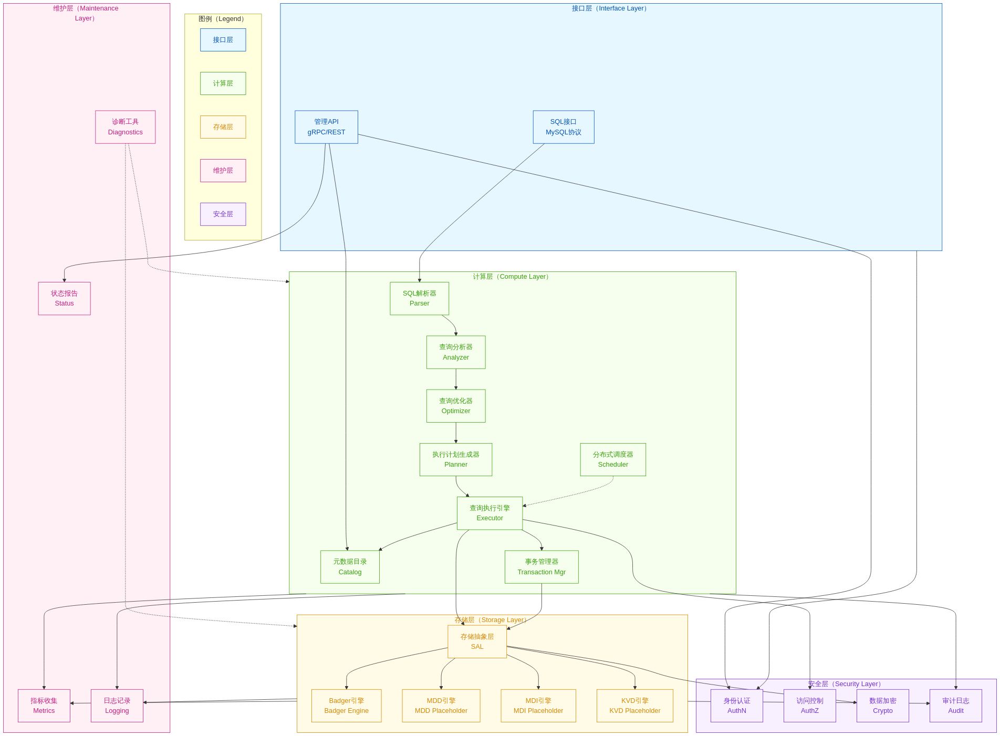
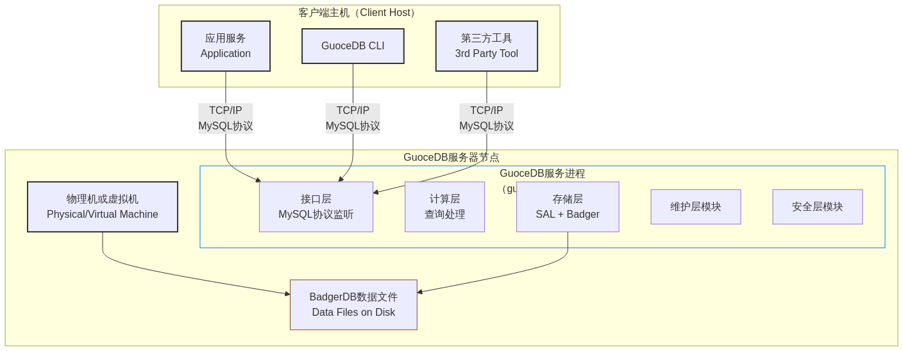
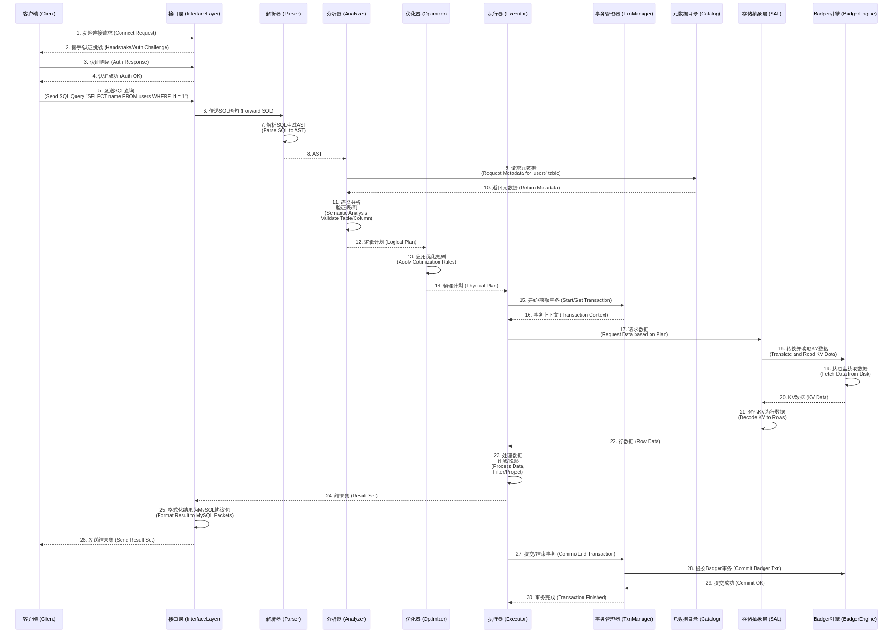

# GuoceDB 架构设计文档

总体架构设计

## 1. 引言

GuoceDB 是一个旨在从零到一构建的、与 MySQL 协议兼容的通用型集中式数据库。本项目借鉴了 `go-mysql-server` [1] 的内存数据库查询引擎能力和 `badger` [2] 的高性能键值存储持久化能力，致力于为一般业务系统提供稳定、高效、易于集成的数据库解决方案。GuoceDB 采用分层设计，以实现高度模块化、可扩展性和可维护性。

## 2. 设计原则

-   **兼容性**: 完全兼容 MySQL 协议，方便现有应用迁移。
-   **分层解耦**: 清晰的层级划分，降低模块间依赖，提高灵活性。
-   **可插拔存储**: 通过存储抽象层 (SAL) 支持多种存储引擎，首选 BadgerDB。
-   **高性能**: 借鉴成熟项目经验，优化查询处理和数据存取。
-   **可维护性**: 清晰的代码结构和文档，易于理解和贡献。
-   **安全性**: 内建多层次安全机制，保障数据安全。

## 3. 总体架构

GuoceDB 的架构设计遵循分层思想，主要包括接口层、计算层、存储层、维护层和安全层。

下图展示了 GuoceDB 的核心组件及其交互关系：

上图简要描述了 GuoceDB 的分层架构。客户端（例如应用服务器或 `guocedb-cli`）通过接口层与数据库交互。SQL 请求主要通过 MySQL 协议接口，而管理操作则通过 gRPC 或 REST API。请求进入计算层后，会经过一系列处理，最终通过存储抽象层与具体的存储引擎交互。维护层和安全层作为横切关注点，贯穿于其他各层，提供监控、日志、安全保障等功能。

### 3.1. 接口层 (Interface Layer)

接口层是 GuoceDB 与外部世界交互的门户，负责接收和响应来自客户端的请求。

-   **SQL 接口**:
    -   实现标准的 MySQL 网络协议，确保与现有 MySQL 客户端和工具（如 Navicat, DBeaver, MySQL CLI）的兼容性。
    -   处理连接管理、认证（与安全层协作）、查询接收和结果集返回。
    -   将基于 `go-mysql-server` 的协议处理逻辑封装在此。
-   **数据生命周期管理 API**:
    -   提供 gRPC 接口（未来可扩展 RESTful 接口）用于数据库管理操作，如创建/删除数据库/表、备份恢复、用户权限管理、系统配置调整等。
    -   定义在 `api/protobuf/mgmt/v1/management.proto`。

### 3.2. 计算层 (Compute Layer)

计算层是 GuoceDB 的核心，负责处理所有查询请求的解析、分析、优化、执行以及事务管理。

-   **SQL 解析器 (Parser)**:
    -   接收 SQL 文本，利用 Vitess 的解析器将其转换为抽象语法树 (AST)。
    -   **Set Operations**: ✅ 已实现 UNION, INTERSECT, EXCEPT 集合操作及其 ALL/DISTINCT 变体。
-   **查询分析器 (Analyzer)**:
    -   对 AST 进行语义分析，包括验证表名、列名、数据类型等，并结合元数据目录进行解析。
    -   同样基于 `go-mysql-server` 的分析逻辑。
-   **查询优化器 (Optimizer)**:
    -   基于规则的优化 (RBO) 和成本的优化 (CBO)（未来规划）对分析后的逻辑计划进行转换，生成更高效的物理执行计划。
    -   借鉴并扩展 `go-mysql-server` 的优化规则。
-   **执行计划 (Plan)**:
    -   定义了查询的各个执行步骤和操作符。
    -   ✅ 已实现 SetOp 节点 (Union, Intersect, Except) 及其执行迭代器。
-   **查询执行引擎 (Executor)**:
    -   根据物理执行计划，实际执行查询操作，与事务管理器和存储层交互以获取或修改数据。
    -   初期可以依赖 `go-mysql-server` 的执行器，未来可以探索向量化执行引擎以提升分析查询 (AP) 性能。
-   **事务管理器 (Transaction Manager)**:
    -   负责实现 ACID 特性，管理事务的开始、提交、回滚。
    -   支持标准 SQL 事务语句 (BEGIN/COMMIT/ROLLBACK) 和多种隔离级别。
    -   与 BadgerDB 事务机制紧密集成，提供原子性和持久性保证。
    -   实现会话级事务状态管理和并发事务隔离。
-   **元数据目录 (Catalog)**:
    -   存储数据库的元信息，如数据库、表、列、索引、视图、用户信息等的定义和统计信息。
    -   提供内存实现和持久化实现（基于底层存储引擎）。
    -   ✅ **Phase 2 完成**: BadgerDB Catalog完全实现`sql.Database`接口和`DatabaseProvider`接口
        - 支持大小写不敏感的数据库和表查找
        - 实现线程安全的并发访问
        - 完整的表生命周期管理（Create/Drop）
        - 提供`GetTableInsensitive`和`GetTableNames`扩展方法
-   **分布式调度器 (Scheduler)**: (未来扩展)
    -   在分布式部署模式下，负责任务的分解、调度和结果汇聚。
    -   通过服务网格 (Service Mesh) 实现弹性伸缩和节点通信。

### 3.3. 存储层 (Storage Layer)

存储层负责数据的实际持久化存储和检索。核心是存储抽象层 (SAL)，它解耦了计算层与具体的存储实现。

-   **存储抽象层 (Storage Abstraction Layer - SAL)**:
    -   定义了一套标准的存储接口 (`interfaces/storage.go`)，如数据库操作、表操作、数据行迭代、索引操作等。
    -   计算层通过 SAL 与下层存储引擎交互，使得替换或增加存储引擎更为容易。
-   **插件式存储引擎**:
    -   **Badger 引擎**:
        -   默认且核心的持久化存储引擎，基于 `dgraph-io/badger/v3`。
        -   提供高性能的键值存储，GuoceDB 在其上构建行式存储、索引等关系数据库特性。
        -   ✅ 已实现键值编码方案用于存储表数据、索引数据和元数据。
        -   ✅ **Phase 2 完成**: 完整实现Table接口
            - 实现`sql.Table`核心接口（Name, Schema, Partitions, PartitionRows）
            - 实现`sql.Inserter`接口用于数据插入
            - 提供`InsertableTable`, `UpdatableTable`, `DeletableTable`扩展接口
            - 支持自管理事务和外部事务两种模式
            - 完整的CRUD操作支持
    -   **MDD/MDI/KVD**:
        -   占位符，代表未来可能支持的其他特定用途存储引擎，例如内存密集型数据 (Memory-Driven Data)、索引专用 (Memory-Driven Index)、或通用键值数据 (Key-Value Data) 存储。

### 3.4. 维护层 (Maintenance Layer)

维护层提供数据库运行状态的监控、诊断和日志记录等功能，保障系统的稳定运行和问题排查。

-   **指标收集 (Metrics)**:
    -   收集关键性能指标 (KPIs)，如 QPS、TPS、延迟、缓存命中率、资源利用率等。
    -   可集成 Prometheus 等监控系统。
-   **日志记录 (Logging)**:
    -   提供统一的日志框架，记录系统运行日志、错误日志、慢查询日志等。
-   **诊断工具 (Diagnostics)**:
    -   提供工具和接口用于问题诊断，如 Profiling、追踪等。
-   **状态报告 (Status)**:
    -   提供查询数据库当前状态、配置、会话信息等的接口。

### 3.5. 安全层 (Security Layer)

安全层负责保障数据库的访问安全和数据安全。

-   **身份认证 (Authentication - AuthN)**:
    -   验证尝试连接到数据库的用户的身份，支持用户名密码等认证方式，与 MySQL 协议的认证机制集成。
-   **访问控制 (Authorization - AuthZ)**:
    -   在身份认证成功后，根据用户角色和权限，控制其对数据库对象（库、表、列等）的访问和操作权限（SELECT, INSERT, UPDATE, DELETE 等）。
-   **数据加解密 (Crypto)**:
    -   支持静态数据加密 (Encryption at Rest) 和传输中数据加密 (Encryption in Transit - SSL/TLS)。
-   **审计日志 (Audit)**:
    -   记录敏感操作和安全相关事件，用于事后追踪和审计。
-   **防篡改、漏洞管理**: (未来规划)
    -   更高级的安全特性，如数据完整性校验、漏洞扫描集成等。

## 4. 部署架构

GuoceDB 初期设计为单机集中式数据库。其典型部署如下图所示：

-   **GuoceDB 服务器节点**: 运行 `guocedb-server` 进程。该进程包含了完整的接口层、计算层、存储层、维护层和安全层逻辑。
-   **BadgerDB 数据文件**: `guocedb-server` 通过存储层将数据持久化到本地磁盘上的 BadgerDB 数据文件中。
-   **客户端**:
    -   **应用服务**: 业务应用程序通过标准的 MySQL 连接器连接 GuoceDB。
    -   **GuoceDB CLI**: 项目提供的命令行工具，用于数据库交互和管理。
    -   **第三方工具**: 任何兼容 MySQL 协议的数据库管理工具。

未来，可以考虑引入分布式协调服务（如 Etcd、Consul）和更复杂的网络拓扑，以支持 GuoceDB 的分布式部署，实现高可用和水平扩展。但初期版本将专注于构建稳定高效的单机版。

## 5. 数据和控制流 (SQL查询示例)

以一个简单的 `SELECT` 查询为例，说明数据和控制流：

上述时序图展示了一个典型SQL查询在GuoceDB内部的流转过程：
1.  **连接与认证**: 客户端与接口层建立连接并完成身份验证。
2.  **查询处理**:
    * SQL语句经过接口层到达计算层的解析器，生成AST。
    * 分析器结合元数据目录对AST进行语义分析和验证，生成逻辑计划。
    * 优化器对逻辑计划进行优化，生成物理执行计划。
3.  **数据获取**:
    * 执行器从事务管理器获取事务上下文。
    * 执行器根据物理计划，通过存储抽象层(SAL)请求数据。
    * SAL将请求转换为对具体存储引擎（如BadgerDB）的操作。BadgerDB从磁盘检索键值对数据。
    * SAL将从BadgerDB获取的键值对解码为行数据，返回给执行器。
    * 执行器根据需要进一步处理数据（如过滤、聚合、排序）。
4.  **返回结果**: 执行器将最终结果集返回给接口层，接口层将其格式化为MySQL协议包发送给客户端。
5.  **事务结束**: 根据事务类型和配置，事务管理器负责事务的提交或回滚。

## 6. 核心依赖

-   **go-mysql-server (GMS)** [1]: 提供MySQL协议兼容层、SQL解析器、查询分析与优化框架、内存查询执行引擎的基础。GuoceDB将大量复用和集成GMS的这些能力。
-   **BadgerDB** [2]: 一个用纯Go编写的快速、嵌入式、持久化的键值存储数据库。GuoceDB将使用BadgerDB作为其主要的持久化存储引擎，在其上构建关系表结构和索引。

## 7. 未来展望

-   **分布式架构**: 支持多节点部署，实现数据分片、高可用和水平扩展。
-   **向量化执行引擎**: 针对分析型查询 (AP) 场景，引入或自研向量化执行能力。
-   **更完善的优化器**: 引入基于成本的优化 (CBO)，支持更复杂的查询优化。
-   **丰富的存储引擎支持**: 通过SAL插件化支持更多的存储引擎，如列式存储、文档存储等。
-   **增强的安全性**: 支持更细粒度的权限控制、行级/列级安全、数据脱敏等。
-   **云原生特性**: 更好的容器化支持、与Kubernetes等编排系统集成。

## 8. 参考

- [1] go-mysql-server: [https://github.com/dolthub/go-mysql-server](https://github.com/dolthub/go-mysql-server)
- [2] badger: [https://github.com/hypermodeinc/badger](https://github.com/hypermodeinc/badger) (或其主流fork如 [https://github.com/dgraph-io/badger](https://github.com/dgraph-io/badger))
