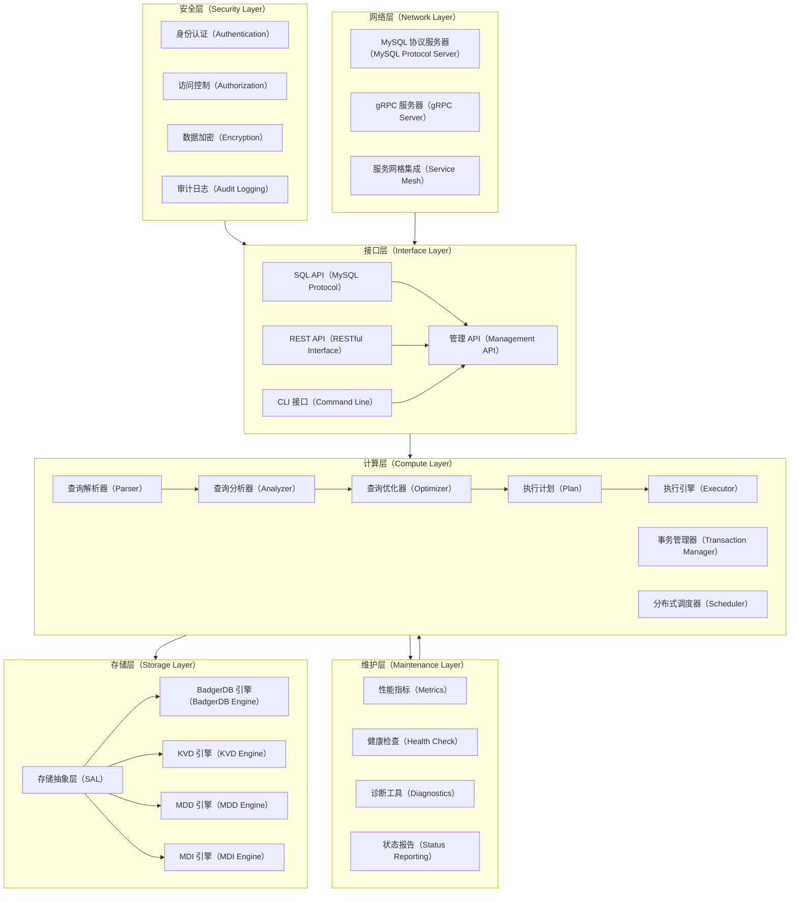
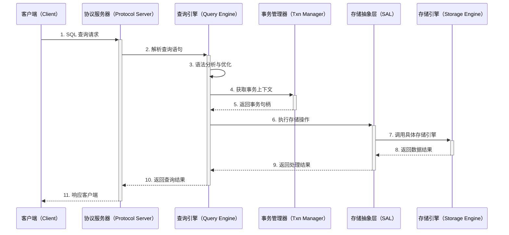
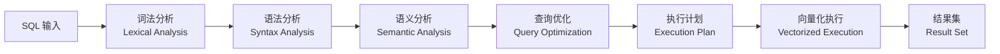
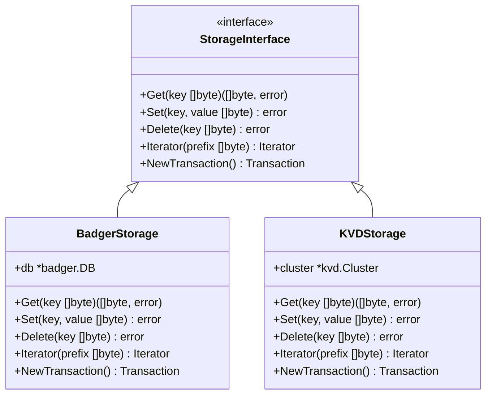
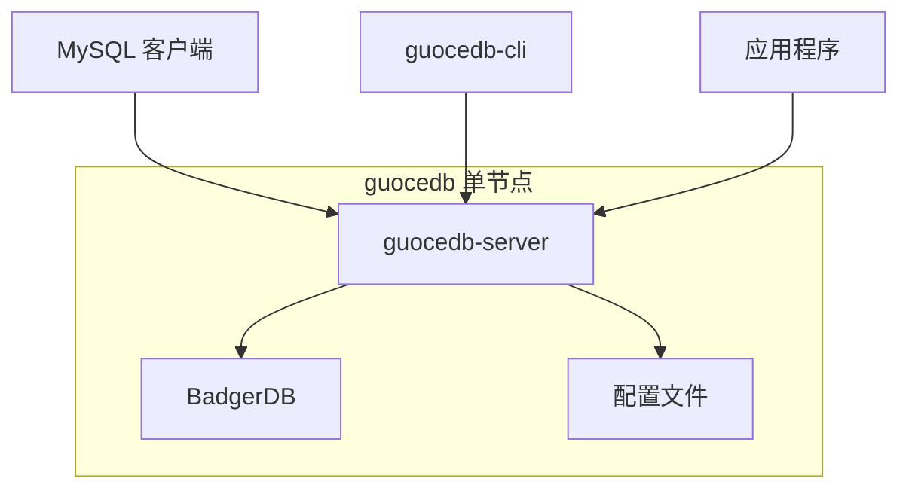
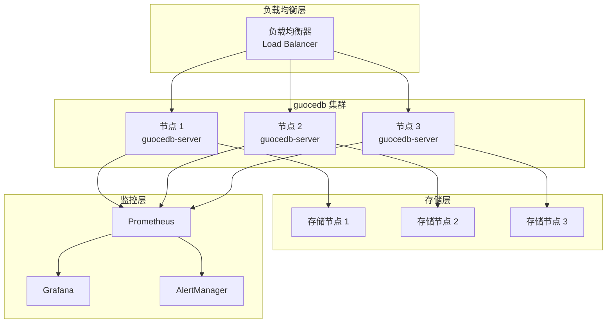

# guocedb 架构设计文档

## 概述
guocedb 是一个现代化的 MySQL 兼容关系型数据库，采用分层架构设计，旨在解决传统数据库在云原生环境中面临的挑战。项目基于 go-mysql-server 的存储无关查询引擎 和 BadgerDB 的高性能键值存储 构建，提供企业级的数据库解决方案。

### DFX 问题全景分析

#### 设计目标（Design）
- **可扩展性**: 支持水平扩展，从单节点到分布式集群的平滑演进
- **兼容性**: 100% MySQL 线路协议兼容，支持现有 MySQL 生态系统
- **性能**: 高吞吐量、低延迟的查询处理能力
- **可靠性**: ACID 事务保证，数据一致性和持久化

#### 功能特性（Features）
- **多存储引擎**: 可插拔的存储后端架构，支持 BadgerDB 及未来扩展
- **分布式事务**: 跨节点的事务一致性保证
- **查询优化**: 基于成本的查询优化器和向量化执行引擎
- **安全机制**: 全面的身份验证、授权和数据加密

#### 体验优化（eXperience）
- **简化部署**: 单二进制文件部署，配置文件驱动
- **监控友好**: 丰富的指标暴露和健康检查端点
- **运维工具**: 完整的 CLI 工具集，支持备份、恢复、诊断等操作

## 解决方案全景

### 技术选型决策
- **主要编程语言**: Go
  - **选择理由**：类型安全、并发支持、生态兼容性
  - **替代方案**：Python（被否决，性能考虑）
- **核心依赖技术**:
  - **go-mysql-server**: 提供 MySQL 协议兼容和查询引擎基础
  - **BadgerDB**: 提供高性能键值存储后端
  - **gRPC**: 内部服务通信和管理 API
  - **Prometheus**: 指标收集和监控

### 架构分层设计

### 数据流架构

## 核心组件详细设计

### 接口层（Interface Layer）
- **MySQL 协议服务器**：
  - 实现完整的 MySQL 线路协议（版本 8.0 兼容）
  - 支持认证握手、查询执行、结果集返回
  - 连接池管理和会话状态维护
- **管理 API**：
  - gRPC 服务提供数据库管理功能
  - RESTful API 支持 HTTP 客户端集成
  - CLI 工具通过 gRPC 与服务器通信

### 计算层（Compute Layer）
- **查询处理流水线**：

- **事务管理**：
  - MVCC（多版本并发控制）实现
  - 分布式事务协调（2PC 协议）
  - 死锁检测和恢复机制

### 存储层（Storage Layer）
- **存储抽象层（SAL）设计**：

## 预期效果与展望

### 性能目标
- **吞吐量**：单节点支持 50,000+ QPS
- **延迟**：P99 延迟 < 5ms
- **扩展性**：支持 100+ 节点集群
- **可用性**：99.99% 服务可用性

### 部署架构

#### 单节点部署

#### 集群部署

